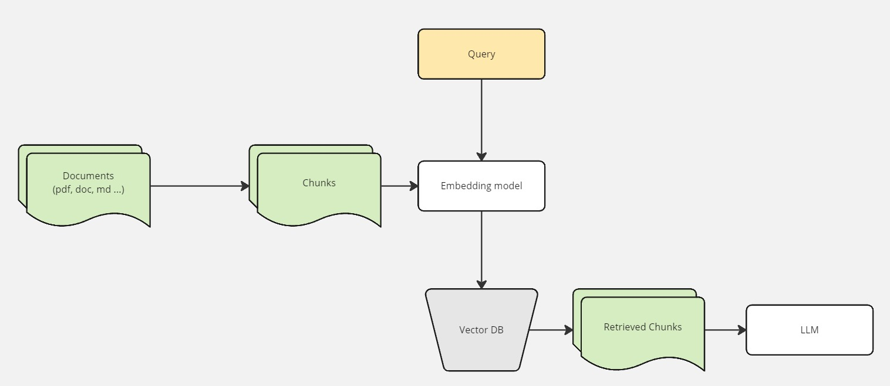
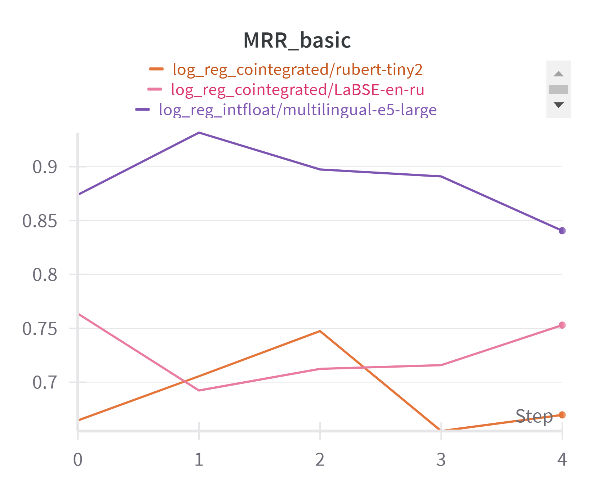

# Cross-encoder for RAG

## Introduction
This project aims to improve the response generation quality of the Retrieval-Augmented Generation (RAG) system by enhancing its retriever component. The focus is on developing a cross-encoder specifically designed for the Russian language, which is currently lacking in publicly available cross-encoders that integrate well with open-source language models.

## Project Structure
The repository contains the following files:

- `classifierData.ipynb`: Prepares data for training the classification model.
- `retrieverData.ipynb`: Contains data used for testing the retriever and calculating the Mean Reciprocal Rank (MRR).
- `retrieverExperiments.py`: Conducts experiments with the retriever using various classification models and embedders.
- `trainBert.py`: Trains the BERT classification model.

## Model Description
The cross-encoder improves the Naive-RAG system by enhancing the ranking of document chunks retrieved based on cosine similarity. The process involves:
1. Retrieving N relevant documents based on cosine similarity between the query vector and document vectors.
2. Re-ranking these documents using a classifier to select the top K most relevant chunks for the LLM.

The chosen embedding models for creating text embeddings are:
- `intfloat/multilingual-e5-large`
- `cointegrated/LaBSE-en-ru`
- `cointegrated/rubert-tiny2`

The classifier is a binary model distinguishing relevant chunks (1) from irrelevant ones (0). Training data consists of open-domain QA datasets in Russian, specifically `russian_super_glue` and `sberquad`, balanced with negative sampling for class balance.

## Experiments and Metrics
The quality of the model is evaluated using the Mean Reciprocal Rank at 5 (MRR@5). Logistic regression was the baseline model, with BERT also trained and tested. Key metrics and results include:
- The highest MRR@5 for `intfloat/multilingual-e5-large` with cosine similarity was 0.93.
- Logistic regression achieved an MRR@5 of 0.85.
- BERT achieved an MRR@5 of 0.89.

In the pictures below, step is `chunk_size`(except for BERT):
- 0 = 128 tokens
- 1 = 256 tokens
- 2 = 512 tokens
- 3 = 1024 tokens
- 4 = 2048 tokens

## Cosine similarity

## LogReg

## BERT

## Conclusion
The cross-encoder does not significantly increase the accuracy of the retriever in the RAG system for queries in Russian on test data. While logistic regression and BERT classifiers showed improvements, the baseline cosine similarity method on `intfloat/multilingual-e5-large` embeddings remained highly effective. Future work may involve further fine-tuning of embedding models or domain-specific classifier training.

## Usage
To replicate the experiments or train the models:
1. Prepare data using `classifierData.ipynb`.
2. Test retriever performance with `retrieverData.ipynb`.
3. Conduct retriever experiments using `retrieverExperiments.py`.
4. Train the BERT classifier with `trainBert.py`.

## Datasets
sberquad [data](https://huggingface.co/datasets/kuznetsoffandrey/sberquad)/[article](https://arxiv.org/abs/1912.09723)

russian_super_glue [data](https://huggingface.co/datasets/RussianNLP/russian_super_glue)/[article](https://arxiv.org/abs/2010.15925)

## References
Rating of Russian-language encoders - encodechka [github](https://github.com/avidale/encodechka)/[article](https://habr.com/ru/articles/669674/)
